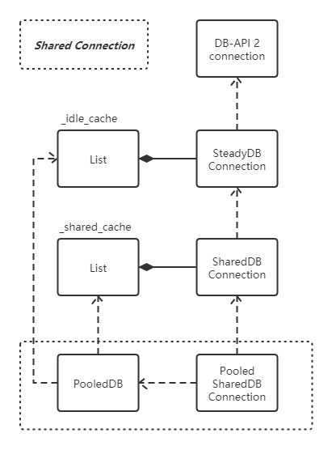

## 一、概述

## 二、DB-API 2
DB-API 2 就是满足 [PEP 249](https://www.python.org/dev/peps/pep-0249/) 规范的模块。PEP 249 规范描述了模块：
* 如何生成数据库连接和游标
* 数据库连接和游标对象的接口
* 模块全局变量
* 其他扩展


PEP 249 提供的重要约束：
* 模块接口
    * 创建连接
        ```py
        cnx = connect( parameters... )
        ```
* 模块变量
    * apilevel, 表示 dbapi 级别：
        * `"1.0"`，模块 DB-API 满足 PEP 248 规范。
        * `"2.0"`，模块 DB-API 满足 PEP 249 规范。
    * threadsafety，表示模块和相关对象的线程安全级别：

        threadsafety|Meaning
        -|-
        0|module（DB-API 2 模块）无法在多个线程间共享。
        1|module 可以多线程之间共享，connection （数据库连接）不能在多个线程之间共享。
        2|module 和 connection 都能在多个线程间共享。
        3|module、connection 和 cursor（数据库游标）可以在多个线程间共享。

    * paramstyle，模块接口期望的参数标记(parameter marker)的格式化风格

        paramstyle|Meaning
        -|-
        qmark|Question mark style, e.g. ...WHERE name=?
        numeric|Numeric, positional style, e.g. ...WHERE name=:1
        named|Named style, e.g. ...WHERE name=:name
        format|ANSI C printf format codes, e.g. ...WHERE name=%s
        pyformat|Python extended format codes, e.g. ...WHERE name=%(name)s

* Exception 结构
    ```
    StandardError
    |__Warning
    |__Error
    |__InterfaceError
    |__DatabaseError
        |__DataError
        |__OperationalError
        |__IntegrityError
        |__InternalError
        |__ProgrammingError
        |__NotSupportedError
    ```
* connection 对象
    * `connection.close()`
    * `connection.commit()`
    * `connection.rollback()`
    * `connection.cursor()`
* cursor 对象
    * cursor 属性
        * `cursor.description`
        * `cursor.rowcount`
    * cursor 方法
        * `cursor.callproc( procname [, parameters ] )`
        * `cursor.close()`
        * `cursor.execute(operation [, parameters])`
        * `cursor.executemany( operation, seq_of_parameters )`
        * `cursor.fetchone()`
        * `cursor.fetchmany([size=cursor.arraysize])`
        * `cursor.fetchall()`
        * `cursor.nextset()`
        * `cursor.arraysize`
        * `cursor.setinputsizes(sizes)`
        * `cursor.setoutputsize(size [, column])`
* 可选的扩展
    * `cursor.rownumber`
    * `cursor.connection`
    * `cursor.scroll(value [, mode='relative' ])`
    * `cursor.messages`
    * `connection.messages`
    * `cursor.next()`
    * `cursor.__iter__()`
    * `cursor.lastrowid`
* 类型对象和构造器
* 其他扩展
    * Exception 扩展
    * 二阶段提交扩展


## 三、DBUtils

### 3.1 UML 类图

#### 3.1.1 SimplePooledDB


#### 3.1.2 PersistentDB


#### 3.1.3 PooledDB





### 3.2 SimplePooledDB.PooledDB
简单的数据库连接池，支持 dedicated 和 shared 两种机制，该类只提供固定连接个数的连接池。

Shared 机制是指的 DB-API 2 Connection 可以在线程之间进行共享时所采用的池化策略。

生产环境通常不会使用该类，因为该池返回的 connection 无法处理连接断开等异常情况。

```py
# SimplePooledDB.PooledDB

class PooledDB:
    def __init__(self,
            dbapi,                 # 满足 PEP 249 的模块
            maxconnections,        # 最大连接个数
            *args, **kwargs):      # db-api 2 建立连接的参数集

        try:
            threadsafety = dbapi.threadsafety
        except Exception:
            threadsafety = None

        if threadsafety == 0:
            raise NotSupportedError(
                "Database module does not support any level of threading.")
        elif threadsafety == 1:
            try:
                from Queue import Queue
            except ImportError:  # Python 3
                from queue import Queue

            self._queue = Queue(maxconnections)  # create the queue
            self.connection = self._unthreadsafe_get_connection
            self.addConnection = self._unthreadsafe_add_connection
            self.returnConnection = self._unthreadsafe_return_connection
        elif threadsafety in (2, 3):
            from threading import Lock
            self._lock = Lock()  # create a lock object to be used later
            self._nextConnection = 0  # index of the next connection to be used
            self._connections = []  # the list of connections
            self.connection = self._threadsafe_get_connection
            self.addConnection = self._threadsafe_add_connection
            self.returnConnection = self._threadsafe_return_connection
        else:
            raise NotSupportedError(
                "Database module threading support cannot be determined.")

        # 初始化所有的连接
        for i in range(maxconnections):
            self.addConnection(dbapi.connect(*args, **kwargs))
```

#### 3.2.1 PooledDBConnection
该类是对数据库连接的包装，用于替换掉数据库连接本身的 `.close()` 方法。

在调用 close 方法时归还连接，而不是关闭连接。

```py
class PooledDBConnection:
    def __init__(self, pool, con):
        self._con = con             # 数据库连接
        self._pool = pool           # SimplePooledDB.PooledDB

    def close(self):
        if self._con is not None:
            self._pool.returnConnection(self._con)  # 归还连接
            self._con = None

    def __getattr__(self, name):
        """代理所有的数据库连接操作
        """
        return getattr(self._con, name)

    def __del__(self):
        """对象被垃圾回收时自动关闭
        """
        self.close()
```

#### 3.2.2 threadsafety 为 1（dedicated）
该场景下，数据库连接不能在线程间共享，只能由一个线程独占。

该场景下，使用 Queue 作为连接池的队列结构，并在返回连接时用 `PooledDBConnection` 包装连接，替换 `close()` 方法。

```py
class PooledDB:
    def __init__(self,
                 dbapi,                 # 满足 PEP 249 的模块
                 maxconnections,        # 最大连接个数
                 *args, **kwargs        # db-api 2 建立连接的参数集
                ):
        # ...

        if threadsafety == 0:
            raise NotSupportedError(
                "Database module does not support any level of threading.")
        elif threadsafety == 1:
            # ...

            self._queue = Queue(maxconnections)  # create the queue
            self.connection = self._unthreadsafe_get_connection
            self.addConnection = self._unthreadsafe_add_connection
            self.returnConnection = self._unthreadsafe_return_connection
        elif threadsafety in (2, 3):
            # ...
        else:
            raise NotSupportedError(
                "Database module threading support cannot be determined.")

        # ...

    def _unthreadsafe_get_connection(self):
        # 包装连接
        return PooledDBConnection(self, self._queue.get())

    def _unthreadsafe_add_connection(self, con):
        self._queue.put(con)

    def _unthreadsafe_return_connection(self, con):
        self._unthreadsafe_add_connection(con)

```


#### 3.2.2 threadsafety 为 2 或 3（shared）
该场景下，连接池可以在线程之间共享，连接池使用 List 存放所有的连接。

```py
class PooledDB:
    """A very simple database connection pool.

    After you have created the connection pool,
    you can get connections using getConnection().

    """

    version = __version__

    def __init__(self, dbapi, maxconnections, *args, **kwargs):
        # ...

        if threadsafety == 0:
            raise NotSupportedError(
                "Database module does not support any level of threading.")
        elif threadsafety == 1:
            # ...
        elif threadsafety in (2, 3):
            from threading import Lock
            self._lock = Lock()  # create a lock object to be used later
            self._nextConnection = 0  # index of the next connection to be used
            self._connections = []  # the list of connections
            self.connection = self._threadsafe_get_connection
            self.addConnection = self._threadsafe_add_connection
            self.returnConnection = self._threadsafe_return_connection
        else:
            raise NotSupportedError(
                "Database module threading support cannot be determined.")
        # ...

    def _threadsafe_get_connection(self):
        self._lock.acquire()
        try:
            next = self._nextConnection
            # 连接仍然在 List 中，并未取出
            con = PooledDBConnection(self, self._connections[next])
            next += 1
            if next >= len(self._connections):
                next = 0
            self._nextConnection = next
            return con
        finally:
            self._lock.release()

    def _threadsafe_add_connection(self, con):
        self._connections.append(con)

    def _threadsafe_return_connection(self, con):
        # 因为连接一直都在 List 中，所以不用归还连接
        pass
```

### 3.3 PersistentDB
PersistentDB 通过 LocalThread 将线程之间的连接进行隔离，具体如下：
* 每个线程首次打开连接都会新建连接，下次重新获取连接会直接复用上次的连接。
* 连接放置到 LocalThread 中，将不同线程的连接进行隔离。
* 对连接的关闭不会真正关闭连接。

通过 PersistentDB 获得的连接大致是这样的：

```
connection = SteadyDBConnection(DBAPI-2-Connection)
```

其中 SteadyDBConnection 提供更稳定的数据库连接（SteadyDBConnection 的 close 方法不会真正的关闭连接）。

```py
class PersistentDB:
    def __init__(
            self,
            creator,            # 符合 DB-API 2 接口的数据库模块。
            maxusage=None,      # 当数据库的操作次数达到 maxusage 时，会自动重置连接。maxusage 为 None 或 0 时，不会计算次数。
            setsession=None,    # 设置一系列的初始 SQL，每当获取一个新的连接，都会先执行这些 SQL 语句。
            failures=None,
            ping=1,             # 何时进行 ping 检测的标识。依赖于 DBAPI 2 Connection 提供的 ping 方法，该方法并不是标准的一部分。
            closeable=False,    # 对连接调用 close 方法时，是否进行连接的关闭。
            threadlocal=None,   # 提供线程隔离的 ThreadLocal 对象，默认时采用系统提供的 ThreadLocal 对象。
            *args, **kwargs):   # DB-API 2 创建连接的参数。
        try:
            threadsafety = creator.threadsafety
        except AttributeError:
            try:
                if not callable(creator.connect):
                    raise AttributeError
            except AttributeError:
                threadsafety = 1
            else:
                threadsafety = 0
        if not threadsafety:
            raise NotSupportedError("Database module is not thread-safe.")
        self._creator = creator
        self._maxusage = maxusage
        self._setsession = setsession
        self._failures = failures
        self._ping = ping
        self._closeable = closeable
        self._args, self._kwargs = args, kwargs
        self.thread = (threadlocal or local)()

    def steady_connection(self):
        return connect(
            self._creator, self._maxusage, self._setsession,
            self._failures, self._ping, self._closeable,
            *self._args, **self._kwargs)

    def connection(self, shareable=False):
        try:
            con = self.thread.connection
        except AttributeError:
            con = self.steady_connection()
            if not con.threadsafety():
                raise NotSupportedError("Database module is not thread-safe.")
            self.thread.connection = con
        con._ping_check()
        return con

    def dedicated_connection(self):
        return self.connection()
```

对于构造函数的 ping 参数，取值和对应的行为：
* 0 = None = 从不进行 ping 校验。
* 1 = default = 任何获取连接的请求都进行 ping 校验。
* 2 = 当 cursor 创建时进行 ping 校验。
* 4 = 当 cursor 进行一次 query 时，进行 ping 校验。
* 7 = 以上所有操作总是进行 ping 校验。

对于 maxusage 参数，以下操作会触使用操作次数递增：
* 获得一个新的 cursor。
* cursor 执行 execute 和 call 方法。

PersistentDB 只是对线程隔离提供了一层封装，其他功能均是在 SteadyDBConnection 中进行的实现。

### 3.4 PooledDB
PooledDB 提供线程安全的数据库连接池，并且支持 dedicated 和 shared 两种机制。

通过 PooledDB 获得的连接大致是这样的：

```sh
# dedicated
connection = PooledDedicatedDBConnection(
                SteadyDBConnection(
                    DBAPI-2-Connection))

# shared
connection = PooledSharedDBConnection(
                SharedDBConnection(
                    SteadyDBConnection(
                        DBAPI-2-Connection)))
```

PooledDB 相关函数:
```py
class PooledDB:
    def __init__(
            self,
            creator,                    # 符合 DB-API 2 接口的数据库模块。
            mincached=0,                # 最小缓存的连接数, pool 初始化时将会预先建立 mincached 个数的连接。
            maxcached=0,                # 最大缓存的连接数, pool 的连接个数超过 maxcached 个数的连接后，将会删除多余的连接。0 表示不回收任何连接。
            maxshared=0,
            maxconnections=0,           # 连接数上限, 0 为不设上限，每当连接达到这个数时，将会阻塞或是抛出异常。shared 机制下，不受该参数影响。
            blocking=False,             # 连接数量达到 maxconnections 后，再获取连接是否会进行阻塞。
            maxusage=None,              # 当连接的操作次数达到 maxusage 时，会自动重置连接。maxusage 为 None 或 0 时，不会计算次数。
            setsession=None,            # 设置一系列的初始 SQL，每当获取一个新的连接，都会先执行这些 SQL 语句
            reset=True,                 # 连接归还给 pool 时，是否进行重置
            failures=None,
            ping=1,                     # 何时进行 ping 检测的标识。依赖于 DBAPI 2 Connection 提供的 ping 方法，该方法并不是标准的一部分。
            *args, **kwargs):           # DB-API 2 创建连接的参数
        # ...

        # 存放连接池的 List
        self._idle_cache = []

        # 初始化连接池
        idle = [self.dedicated_connection() for i in range(mincached)]
        while idle:
            idle.pop().close()

```

对于构造函数的 ping 参数，取值和对应的行为：
* 0 = None = 从不进行 ping 校验（如果 connection 不支持 ping，则无论 ping 设置为何值，都会退化为 ping == 0）。
* 1 = default = 从池中获取连接的请求都进行 ping 校验。
* 2 = 当 cursor 创建时进行 ping 校验。
* 4 = 当 cursor 进行一次 query 时，进行 ping 校验。
* 7 = 以上所有操作总是进行 ping 校验。

对于 maxusage 参数，以下操作会触使用操作次数递增：
* 获得一个新的 cursor。
* cursor 执行 execute 和 call 方法。


### 3.4.1 Dedicated 和 Shared 机制
对于 maxshared 参数，用于在 Shared 机制下进行控制，Shared 机制是指的 DB-API 2 Connection 可以在线程之间进行共享时所采用的池化策略。

在构建连接池的时候，就会决定采用 Dedicated 还是 Shared 机制。
```py
class PooledDB:
    def __init__(
            self, creator, mincached=0, maxcached=0,
            maxshared=0, maxconnections=0, blocking=False,
            maxusage=None, setsession=None, reset=True,
            failures=None, ping=1,
            *args, **kwargs):
        try:
            threadsafety = creator.threadsafety
        except AttributeError:
            try:
                if not callable(creator.connect):
                    raise AttributeError
            except AttributeError:
                threadsafety = 2
            else:
                threadsafety = 0
        if not threadsafety:
            raise NotSupportedError("Database module is not thread-safe.")

        # ...

        if threadsafety > 1 and maxshared:
            self._maxshared = maxshared
            self._shared_cache = []  # the cache for shared connections
        else:
            self._maxshared = 0

        # ...

```

根据源码，非常明显，threadsafety 为 2 或 3 时，且 maxshared >= 1 时，才会启用 shared 机制，否则强制设置 maxshared = 0。

#### 3.4.1 Dedicated 机制

Dedicated 机制拿到的连接被 PooledDedicatedDBConnection 包装，该类用于替换掉 close 方法，每当调用 close 方法时归还连接：
```py
class PooledDedicatedDBConnection:
    def __init__(self, pool, con):
        self._con = None
        if not con.threadsafety():
            raise NotSupportedError("Database module is not thread-safe.")
        self._pool = pool
        self._con = con

    def close(self):
        """关闭连接，将连接返回给连接池。
        """
        if self._con:
            self._pool.cache(self._con)
            self._con = None

    def __getattr__(self, name):
        """代理了 SteadyDBConnection 的所有方法。
        """
        if self._con:
            return getattr(self._con, name)
        else:
            raise InvalidConnection

    def __del__(self):
        """引用丢失时，自动触发连接关闭。
        """
        try:
            self.close()
        except Exception:
            pass
```

非常明显，close 方法的调用会调用 `self._pool.cache(self._con)`，将连接归还到池中：
```py
class PooledDB:
    # ...

    def cache(self, con):
        """将 connection 放到连接池中
        """
        self._lock.acquire()
        try:
            if not self._maxcached or len(self._idle_cache) < self._maxcached:
                # 归还到连接池前，先重置连接，重置连接的实现请参考 SteadyDBConnection 的实现
                con._reset(force=self._reset)
                self._idle_cache.append(con)
            else:
                # 如果空闲连接个数 >= maxcached，则将多余的连接关闭
                con.close()
            self._connections -= 1
            self._lock.notify()
        finally:
            self._lock.release()
```

再来看如何获取连接，获得连接有 3 种方式：
* `pooled.steady_connection()`，获得 SteadyDBConnection 连接，该连接不受 pooled 管理。
* `pooled.dedicated_connection()`，从池内获得专用连接，该连接被 `PooledDedicatedDBConnection` 包装，会受到 pooled 管理。
* `pooled.connection(shareable=True)`，从池内获得一个连接，会根据 `maxshared` 判断连接是否使用 Shared 机制。

```py
class PooledDB:
    # ...

    def steady_connection(self):
        """获得一个独立的 SteadyDBConnection
        """
        return connect(
            self._creator, self._maxusage, self._setsession,
            self._failures, self._ping, True, *self._args, **self._kwargs)

    def dedicated_connection(self):
        """从池中获得一个 Dedicated Connection
        """
        return self.connection(False)

    def connection(self, shareable=True):
        if shareable and self._maxshared:
            # 采用 Shared 机制
            # ...
        else:
            # 采用 Dedicated 机制
            self._lock.acquire()
            try:
                # 当连接达到 maxconnections，触发 wait_lock()，线程等待（若 blocking == False 会抛出异常）
                while (self._maxconnections
                        and self._connections >= self._maxconnections):
                    self._wait_lock()
                try:
                    con = self._idle_cache.pop(0)
                except IndexError:
                    # 如果连接为空，则创建一个 SteadyDBConnection
                    con = self.steady_connection()
                else:
                    # 如果从池中拿到连接，对连接进行检查（实际是否检查要根据 ping 参数）
                    con._ping_check()
                # 将 SteadyDBConnection 进行包装
                con = PooledDedicatedDBConnection(self, con)
                self._connections += 1
            finally:
                self._lock.release()
        return con

    def _wait_lock(self):
        """当连接个数达到 maxconnections 时，继续获取连接会触发该函数
        """
        if not self._blocking:
            raise TooManyConnections
        self._lock.wait()
```

从上述描述中可以看出，`_idle_cache` 连接池中存储的是 SteadyDBConnection，并根据连接的共享方式，对 SteadyDBConnection 进行包装：
* 连接不能共享（Dedicated），使用 `PooledDedicatedDBConnection` 进行包装。
* 连接可以共享（Shared），使用 `PooledSharedDBConnection` 和 `SharedDBConnection` 进行包装。

#### 3.4.2 Shared 机制

Shared 机制拿到的连接被 PooledSharedDBConnection 和 SharedDBConnection 包装
* PooledSharedDBConnection，管理对连接的释放，当引用计数为 0 的时候，将连接从 `_shared_cache` 中移出，并放置到 `_idle_cache` 中。
* SharedDBConnection，提供对 SteadyDBConnection 连接的引用计数，以及根据引用计数进行排序的相关方法。

```py
class PooledDB:
    # ...

    def connection(self, shareable=True):
        if shareable and self._maxshared:
            # 触发 Shared 机制
            self._lock.acquire()
            try:
                # 如果 shared_cache 缓存为空（无法共享连接），并且当前连接数达到 maxconnections 则进行等待。
                while (not self._shared_cache and
                        self._maxconnections and
                        self._connections >= self._maxconnections):
                    self._wait_lock()

                # 如果 shared_cache 没有满，则获得一个 SteadyDBConnection，用 SharedDBConnection 包装，并存入 shared_cache
                if len(self._shared_cache) < self._maxshared:
                    try:
                        con = self._idle_cache.pop(0)
                    except IndexError:
                        con = self.steady_connection()
                    else:
                        con._ping_check()  # check this connection
                    con = SharedDBConnection(con)
                    self._connections += 1
                else:
                    # shared_cache 如果满了，则直接从 shared_cache 中获取连接
                    self._shared_cache.sort()
                    con = self._shared_cache.pop(0)
                    # 如果连接处于事务中，则等待其他连接归还
                    while con.con._transaction:
                        self._shared_cache.insert(0, con)
                        self._wait_lock()
                        self._shared_cache.sort()
                        con = self._shared_cache.pop(0)
                    # 检查连接
                    con.con._ping_check()
                    # 增加连接的引用次数
                    con.share()
                # put the connection (back) into the shared cache
                self._shared_cache.append(con)
                self._lock.notify()
            finally:
                self._lock.release()
            con = PooledSharedDBConnection(self, con)
        else:
            # ...
        return con
```

`_shared_cache` 结构存放的是被 `SharedDBConnection` 包装的 Steady Connection，可以非常方便的获得引用计数最小的共享连接。

SharedDBConnection 的实现：
```py
class SharedDBConnection:
    def __init__(self, con):
        self.con = con
        self.shared = 1

    def __lt__(self, other):
        if self.con._transaction == other.con._transaction:
            return self.shared < other.shared
        else:
            return not self.con._transaction

    def __le__(self, other):
        if self.con._transaction == other.con._transaction:
            return self.shared <= other.shared
        else:
            return not self.con._transaction

    def __eq__(self, other):
        return (self.con._transaction == other.con._transaction
                and self.shared == other.shared)

    def __ne__(self, other):
        return not self.__eq__(other)

    def __gt__(self, other):
        return other.__lt__(self)

    def __ge__(self, other):
        return other.__le__(self)

    def share(self):
        self.shared += 1

    def unshare(self):
        self.shared -= 1
```

PooledSharedDBConnection 的实现：
```py
class PooledDB:
    def unshare(self, con):
        """减少共享连接的引用，并处理连接所处的缓存
        """
        self._lock.acquire()
        try:
            # SharedDBConnection.unshare()
            con.unshare()
            shared = con.shared
            if not shared:
                 # 如果连接没有被共享了，则连接已经空闲，从 shared_cache 中剔除。
                try:
                    self._shared_cache.remove(con)
                except ValueError:
                    pass
        finally:
            self._lock.release()
        if not shared:
            # connection has become idle, so add it to the idle cache
            self.cache(con.con)

class PooledSharedDBConnection:
    def __init__(self, pool, shared_con):
        self._con = None
        con = shared_con.con
        if not con.threadsafety() > 1:
            raise NotSupportedError("Database connection is not thread-safe.")
        self._pool = pool
        self._shared_con = shared_con
        self._con = con

    def close(self):
        """关闭连接，触发 unshare，减少共享连接引用，连接应用归零时放置到 _idle_cache
        """
        if self._con:
            self._pool.unshare(self._shared_con)
            self._shared_con = self._con = None

    def __getattr__(self, name):
        """代理 SteadyDBConnection 的所有方法
        """
        if self._con:
            return getattr(self._con, name)
        else:
            raise InvalidConnection

    def __del__(self):
        try:
            self.close()
        except Exception:
            pass
```

### 3.5 SteadyDBConnection
对 DB-API 2 Connection 进行的包装，提供了丰富的功能，包括：
* 对连接的自动检测
* 连接异常时的处理
* 请求充实
* 预置会话
* maxusage

#### 3.5.1 连接初始化
```py
class SteadyDBConnection:
    """A "tough" version of DB-API 2 connections."""

    version = __version__

    def __init__(
            self, creator, maxusage=None, setsession=None,
            failures=None, ping=1, closeable=True, *args, **kwargs):
        # 参数的初始化和校验 ...
        self._args, self._kwargs = args, kwargs
        self._creator = creator.connect
        self._store(self._create())

    def _create(self):
        """创建一个新的连接
        """
        con = self._creator(*self._args, **self._kwargs)
        try:
            # 一些参数初始化和校验 ...
            self._setsession(con)
        except Exception as error:
            try:
                con.close()
            except Exception:
                pass
            raise error
        return con

    def _setsession(self, con=None):
        if con is None:
            con = self._con
        if self._setsession_sql:
            cursor = con.cursor()
            for sql in self._setsession_sql:
                cursor.execute(sql)
            cursor.close()

    def _store(self, con):
        """将连接进行存储，并初始化参数
        """
        self._con = con
        self._transaction = False
        self._closed = False
        self._usage = 0

    def close(self):
        """关闭连接，如果连接不可关闭，则重置连接
        """
        if self._closeable:
            self._close()
        elif self._transaction:
            self._reset()

    def _close(self):
        """进行实际连接关闭的函数
        """
        if not self._closed:
            try:
                self._con.close()
            except Exception:
                pass
            self._transaction = False
            self._closed = True

    def _reset(self, force=False):
        """如果存在事务或强制 reset，则回滚连接
        """
        if not self._closed and (force or self._transaction):
            try:
                self.rollback()
            except Exception:
                pass
```

#### 3.5.2 连接 ping 检测

SteadyDB 进行 ping 检测要求 DB-API 2 的连接对象实现了 ping 方法，但是该方法并不属于 PEP 249 的规范，因此对于不支持 ping 方法的 DB-API 2 连接对象无法进行 ping 检测，如果要进行 ping 检测可以自行封装。

ping 检测会在连接异常时，自动重新连接。

```py
class SteadyDBConnection:
    def ping(self, *args, **kwargs):
        """Ping connection."""
        return self._con.ping(*args, **kwargs)

    def _ping_check(self,
                    ping=1,             # 默认为获取连接的场景
                    reconnect=True):    # 为 True 时，连接异常会重新连接
        """检查连接，如果连接异常则重新启动连接
        """
        if ping & self._ping:
            try:
                alive = self._con.ping()
            except (AttributeError, IndexError, TypeError, ValueError):
                self._ping = 0  # ping() is not available
                alive = None
                reconnect = False
            except Exception:
                alive = False
            else:
                if alive is None:
                    alive = True
                if alive:
                    reconnect = False
            # 如果需要进行重连且，数据库连接没有处于事务中，则重新连接
            if reconnect and not self._transaction:
                try:  # try to reopen the connection
                    con = self._create()
                except Exception:
                    pass
                else:
                    # 先退出之前的连接
                    self._close()
                    # 包装新的数据库连接
                    self._store(con)
                    alive = True
            return alive
```

#### 3.5.3 事务机制

SteadyDBConnection 提供了对事务机制的包装，主要是用于决策在连接 reset，reconnect，close 时的具体行为：
* reset，如果处于事务中，则回滚事务。
* reconnect，如果处于事务中，则不进行 reconnect。
* close，如果不允许关闭连接，但由处于事务中，则进行连接的 reset （回滚）。

SteadyDBConnection 的事务机制，完全依赖是否调用 `SteadyDBConnection.begin()` 方法，而不管 DB-API 2 的连接到底有没有提供事务。

正是因为这个原因：
* 如果没有调用 SteadyDBConnection 的 `begin` 方法，虽然 MySQL 服务实际上用了事务机制，但是 SteadyDBConnection 当作没有开启事务进行处理。
* 如果调用了 SteadyDBConnection 的 `begin` 方法，虽然 DB-API 2 Connection 并没有实现 begin 方法，仍然被 SteadyDBConnection 认为开启了连接。

```py
class SteadyDBConnection:
    def begin(self, *args, **kwargs):
        """指示事务开始
        """
        self._transaction = True
        try:
            # 事实上该方法并不属于 PEP 249，常见的 MySQL Connection 也并没有去实现 `begin()` 方法。
            begin = self._con.begin
        except AttributeError:
            pass
        else:
            begin(*args, **kwargs)

    def commit(self):
        self._transaction = False
        try:
            self._con.commit()
        except self._failures as error:  # cannot commit
            # 异常处理

    def rollback(self):
        self._transaction = False
        try:
            self._con.rollback()
        except self._failures as error:  # cannot rollback
            # 异常处理

    def cancel(self):
        """取消事务，该方法并不属于 PEP 249 规范，对于常见的 MySQL Connection 没有实际作用。
        """
        self._transaction = False
        try:
            cancel = self._con.cancel
        except AttributeError:
            pass
        else:
            cancel()
```

#### 3.5.4 游标

SteadyDBConnectino 返回的 cursor 并不是 DB-API 2 Cursor，而是对其的封装：SteadyDBCursor。

SteadyDBCursor 的主要目的是封装其调用，计数是否触发 maxusage 以及网络请求异常时的故障恢复。

```py
class SteadyDBConnection:
    def cursor(self, *args, **kwargs):
        return SteadyDBCursor(self, *args, **kwargs)

    def _cursor(self, *args, **kwargs):
        transaction = self._transaction
        if not transaction:
            # 获取 cursor 时进行 ping 检测
            self._ping_check(2)
        try:
            if self._maxusage:
                if self._usage >= self._maxusage:
                    raise self._failure
            cursor = self._con.cursor(*args, **kwargs)  # try to get a cursor
        except self._failures as error:  # error in getting cursor
            # 故障处理
        return cursor


class SteadyDBCursor:
    def __init__(self, con, *args, **kwargs):
        # basic initialization to make finalizer work
        self._cursor = None
        self._closed = True
        # proper initialization of the cursor
        self._con = con
        self._args, self._kwargs = args, kwargs
        self._clearsizes()
        try:
            # 会触发进行获取 cursor 时的 ping 检测以及故障处理
            self._cursor = con._cursor(*args, **kwargs)
        except AttributeError:
            raise TypeError("%r is not a SteadyDBConnection." % (con,))
        self._closed = False

     def close(self):
        """关闭游标
        """
        if not self._closed:
            try:
                self._cursor.close()
            except Exception:
                pass
            self._closed = True

    def __del__(self):
        try:
            self.close()  # make sure the cursor is closed
        except Exception:
            pass

    def _get_tough_method(self, name):
        """Return a "tough" version of the given cursor method."""
        def tough_method(*args, **kwargs):
            execute = name.startswith('execute')
            con = self._con
            transaction = con._transaction
            if not transaction:
                con._ping_check(4)
            try:
                if con._maxusage:
                    if con._usage >= con._maxusage:
                        # 连接用的过多，抛出异常，并子啊故障处理中会重建连接并重新请求
                        raise con._failure
                if execute:
                    self._setsizes()

                # 获得真正的 cursor 方法，并执行
                method = getattr(self._cursor, name)
                result = method(*args, **kwargs)  # try to execute
                if execute:
                    self._clearsizes()
            except con._failures as error:  # execution error
                # 故障处理
            else:
                con._usage += 1
                return result
        return tough_method

    def __getattr__(self, name):
        """代理 DB-API 2 Cursor
        """
        if self._cursor:
            if name.startswith(('execute', 'call')):
                # 如果请求的方法为 execute 和 call 开头，则返回一个对代理函数，该函数会进行 maxusage 判断和故障恢复
                return self._get_tough_method(name)
            else:
                return getattr(self._cursor, name)
        else:
            raise InvalidCursor
```

#### 3.5.5 故障恢复

故障恢复主要是处于以下场景：
* 获取 connection。在 PooledDB 中获取连接，并进行连接检查时触发。
* 在提交事务、回滚事务时。操作失败会重新进行数据库连接，并仍然抛出异常。
* 获取 cursor。在 SteadyDBConnection 中获取 cursor，并进行连接检查时触发。
* 执行 cursor 的 execute 和 call 方法。
    * 首先检查连接，如果异常重启连接。
    * 最后执行请求，如果异常则也会重启连接。

```py
class SteadyDBConnection:
    def commit(self):
        """Commit any pending transaction."""
        self._transaction = False
        try:
            self._con.commit()
        except self._failures as error:  # cannot commit
            try:  # try to reopen the connection
                con = self._create()
            except Exception:
                pass
            else:
                self._close()
                self._store(con)
            raise error  # re-raise the original error

    def rollback(self):
        """Rollback pending transaction."""
        self._transaction = False
        try:
            self._con.rollback()
        except self._failures as error:  # cannot rollback
            try:  # try to reopen the connection
                con = self._create()
            except Exception:
                pass
            else:
                self._close()
                self._store(con)
            raise error  # re-raise the original error

    def _cursor(self, *args, **kwargs):
        transaction = self._transaction
        if not transaction:
            # 获取 cursor 时进行 ping 检测
            self._ping_check(2)
        try:
            if self._maxusage:
                if self._usage >= self._maxusage:
                    raise self._failure
            cursor = self._con.cursor(*args, **kwargs)  # try to get a cursor
        except self._failures as error:  # error in getting cursor
            # 故障处理
        return cursor


class SteadyDBCursor:
    def _get_tough_method(self, name):
        def tough_method(*args, **kwargs):
            execute = name.startswith('execute')
            con = self._con
            transaction = con._transaction
            if not transaction:
                # 检查连接，如果连接异常则会重置
                con._ping_check(4)
            try:
                # ...
                method = getattr(self._cursor, name)
                result = method(*args, **kwargs)  # try to execute
            except con._failures as error:  # execution error
                if not transaction:
                    try:
                        cursor2 = con._cursor(
                            *self._args, **self._kwargs)  # open new cursor
                    except Exception:
                        pass
                    else:
                        try:  # and try one more time to execute
                            if execute:
                                self._setsizes(cursor2)
                            method = getattr(cursor2, name)
                            result = method(*args, **kwargs)
                            if execute:
                                self._clearsizes()
                        except Exception:
                            pass
                        else:
                            self.close()
                            self._cursor = cursor2
                            con._usage += 1
                            return result
                        try:
                            cursor2.close()
                        except Exception:
                            pass
                try:  # try to reopen the connection
                    con2 = con._create()
                except Exception:
                    pass
                else:
                    try:
                        cursor2 = con2.cursor(
                            *self._args, **self._kwargs)  # open new cursor
                    except Exception:
                        pass
                    else:
                        if transaction:
                            self.close()
                            con._close()
                            con._store(con2)
                            self._cursor = cursor2
                            raise error  # raise the original error again
                        error2 = None
                        try:  # try one more time to execute
                            if execute:
                                self._setsizes(cursor2)
                            method2 = getattr(cursor2, name)
                            result = method2(*args, **kwargs)
                            if execute:
                                self._clearsizes()
                        except error.__class__:  # same execution error
                            use2 = False
                            error2 = error
                        except Exception as error:  # other execution errors
                            use2 = True
                            error2 = error
                        else:
                            use2 = True
                        if use2:
                            self.close()
                            con._close()
                            con._store(con2)
                            self._cursor = cursor2
                            con._usage += 1
                            if error2:
                                raise error2  # raise the other error
                            return result
                        try:
                            cursor2.close()
                        except Exception:
                            pass
                    try:
                        con2.close()
                    except Exception:
                        pass
                if transaction:
                    self._transaction = False
                raise error  # re-raise the original error again
            else:
                con._usage += 1
                return result
        return tough_method
```

## 四、MySQL 驱动

### 4.1 MySQL 连接

### 4.2 MySQL 游标

### 4.3 其他技巧


## 附录、参考文献
* [PEP 0249](https://www.python.org/dev/peps/pep-0249/)
* [PEP 0248](https://www.python.org/dev/peps/pep-0248/)
* [DBUtils User's Guide](https://webwareforpython.github.io/DBUtils/UsersGuide.html)
* [How to Use MySQL in Python](https://github.com/lsj9383/how-to-use-mysql-in-python/blob/master/README.md)
